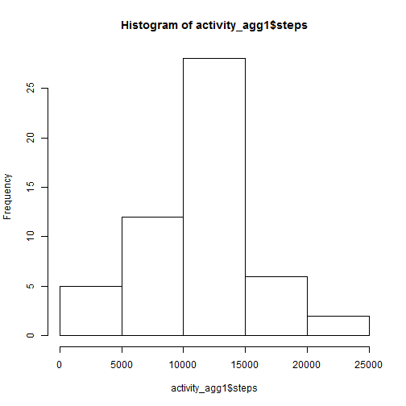
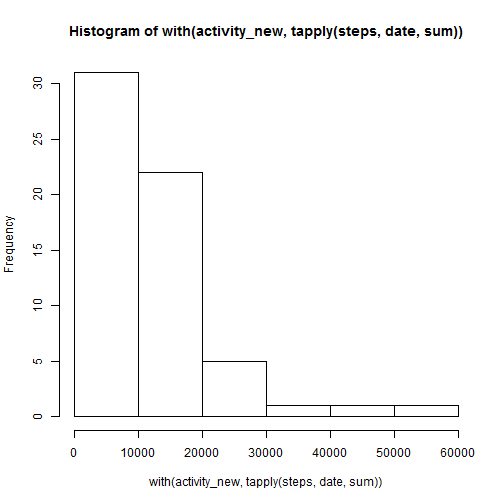
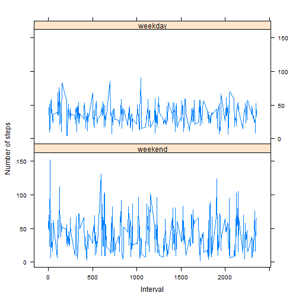

# Reproducible Research: Peer Assessment 1


## Loading and preprocessing the data
1. Load the data
  
  ```r
  Sys.setlocale("LC_TIME", "English")
  ```
  
  ```
  ## [1] "English_United States.1252"
  ```
  
  ```r
  options(scipen = 999)
  setwd("D:/Dropbox/Workshops&Courses/reproducible_research/RepData_PeerAssessment1")
  activity <- read.csv(unz("activity.zip", "activity.csv"))
  ```


2. Transform the date column to the `Date` format in R. Also make the aggregated data set. 
  
  ```r
  activity <- transform(activity, date = as.Date(date, format = "%Y-%m-%d"))
  activity_agg1 <- aggregate(. ~ date, data = activity, FUN = sum)
  ```


## What is mean total number of steps taken per day?
1. Histogram:
  
  ```r
  hist(activity_agg1$steps)
  ```
  
   


  
  ```r
  mean1 <- mean(activity_agg1$steps)
  median1 <- median(activity_agg1$steps)
  ```


2. The mean total number of steps is 10766.1887 and the median is 10765.

## What is the average daily activity pattern?
1. Time series plot (again using the `aggregate` function in R)
  
  ```r
  activity_agg2 <- aggregate(steps ~ interval, data = activity, FUN = mean)
  plot(steps ~ interval, data = activity_agg2, type = "l")
  ```
  
   


  
  ```r
  activity_agg2[which.max(activity_agg2$steps), ]
  ```
  
  ```
  ##     interval steps
  ## 104      835 206.2
  ```


2. The interval between 835 and 840 contains the maximum number of steps (206.1698)

## Imputing missing values
  
  ```r
  sum(!complete.cases(activity))
  ```
  
  ```
  ## [1] 2304
  ```


1. The total number of missing values is 2304. 

  
  ```r
  matching <- function(x) {
      count_NA <- sum(is.na(x))
      if (count_NA > 0) {
          imputed_values <- sample(x[!is.na(x)], count_NA, replace = TRUE)
          x[is.na(x)] <- imputed_values
      }
      return(x)
  }
  ```

  
2. I've written a simple function `matching` as above, where for each missing value, a number is randomly taken from other observations within the same 5-minute interval for imputation. 
  
  
  ```r
  activity_new <- within(activity, steps <- unlist(tapply(steps, interval, matching)))
  ```

3. The new dataset is `activity_new`.
  
4. Below shows the histogram

  
  ```r
  hist(with(activity_new, tapply(steps, date, sum)))
  ```
  
   
  
  ```r
  mean(with(activity_new, tapply(steps, date, sum)))
  ```
  
  ```
  ## [1] 10695
  ```
  
  ```r
  median(with(activity_new, tapply(steps, date, sum)))
  ```
  
  ```
  ## [1] 9918
  ```


  The mean is 10695.0656 and the median is 9918.

The total number of missing values are 2304. The values do not differ much from the estimates in the first part. 

## Are there differences in activity patterns between weekdays and weekends?
1. Below is the transformed data.

  
  ```r
  activity_new <- within(activity_new, weekday <- weekdays(date))
  activity_new <- within(activity_new, weekday <- !(weekday %in% c("Saturday", 
      "Sunday")))
  activity_new <- within(activity_new, weekday <- factor(weekday, labels = c("weekend", 
      "weekday")))
  summary(activity_new)
  ```
  
  ```
  ##      steps            date               interval       weekday     
  ##  Min.   :  0.0   Min.   :2012-10-01   Min.   :   0   weekend: 4608  
  ##  1st Qu.:  0.0   1st Qu.:2012-10-16   1st Qu.: 589   weekday:12960  
  ##  Median :  0.0   Median :2012-10-31   Median :1178                  
  ##  Mean   : 37.1   Mean   :2012-10-31   Mean   :1178                  
  ##  3rd Qu.: 12.0   3rd Qu.:2012-11-15   3rd Qu.:1766                  
  ##  Max.   :806.0   Max.   :2012-11-30   Max.   :2355
  ```

2. Below shows the plot.   
  
  
  ```r
  activity_agg1_new <- aggregate(. ~ interval + weekday, data = activity_new, 
      FUN = mean)
  library(lattice)
  xyplot(steps ~ interval | weekday, data = activity_agg1_new, type = "l", layout = c(1, 
      2), ylab = "Number of steps", xlab = "Interval")
  ```
  
   

